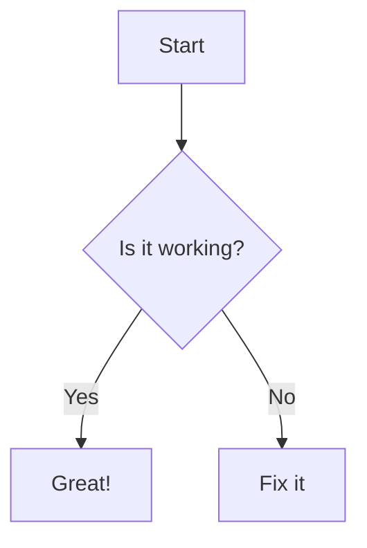

+++
date = '2025-04-14T22:14:47+09:00'  # 작성 날짜
draft = false  # 초안 여부
title = 'My First Post Test'  # 글 제목
tags = ['test', 'hugo', 'example']  # 태그 목록
categories = ['Tutorial', 'Hugo']  # 카테고리 목록
url = '/posts/my-first-post/'  # 커스텀 URL 경로
description = 'This is an example post with various features.'  # 페이지 설명
images = ['/images/cover.jpg']  # 대표 이미지 
# authorbox= false
# sidebar= false
# pager= false
# weight= 1
menus = 'main'
+++

# My First Post Test

## 1. 표 (Table)
Markdown에서 표를 작성하는 방법:
| Header 1 | Header 2 | Header 3 |
|----------|----------|----------|
| Row 1    | Data 1   | Data 2   |
| Row 2    | Data 3   | Data 4   |

---

## 2. 수식 (Math)
Hugo에서 수식을 작성하려면 MathJax 또는 KaTeX를 사용해야 합니다. 아래는 LaTeX 스타일의 수식 예제입니다:

### 인라인 수식
`$E = mc^2$` → $E = mc^2$

### 블록 수식
```math
\int_{a}^{b} x^2 dx = \frac{b^3}{3} - \frac{a^3}{3}
```

---

## 3. 그림 (Image)
이미지를 삽입하는 방법:

### 로컬 이미지


### 외부 이미지


---

## 4. 그래프 (Graph)
Hugo에서 그래프를 삽입하려면 D3.js, Mermaid, 또는 Chart.js 같은 라이브러리를 사용할 수 있습니다. 아래는 Mermaid를 사용한 예제입니다:



---

## 5. 링크 (Links)
링크를 삽입하는 방법:

### 내부 링크
[Go to Homepage](/)

### 외부 링크
[Visit Hugo](https://gohugo.io)

---

## 6. 코드 블록 (Code Block)
코드 블록을 삽입하는 방법:

```python
# Python 예제 코드
def hello_world():
    print("Hello, World!")
```

---

## 7. 목록 (Lists)
### 순서 있는 목록
1. 첫 번째 항목
2. 두 번째 항목
3. 세 번째 항목

### 순서 없는 목록
- 항목 1
- 항목 2
- 항목 3

---

## 8. 인용문 (Blockquote)
> 이것은 인용문입니다.  
> 여러 줄로 작성할 수도 있습니다.

---

## 9. 강조 (Emphasis)
- **굵게**: `**굵게**`
- *기울임*: `*기울임*`
- ~~취소선~~: `~~취소선~~`

---

## 10. 분할선 (Horizontal Rule)
아래는 분할선입니다:

---

---

## 11. 주석 (Comments)
Markdown에는 직접 주석을 작성할 수 없으므로 HTML 주석을 사용합니다.

<!-- 이것은 주석입니다. -->

---

이 파일은 Hugo에서 다양한 기능을 사용하는 예제입니다. 필요에 따라 수정하여 사용하세요!
